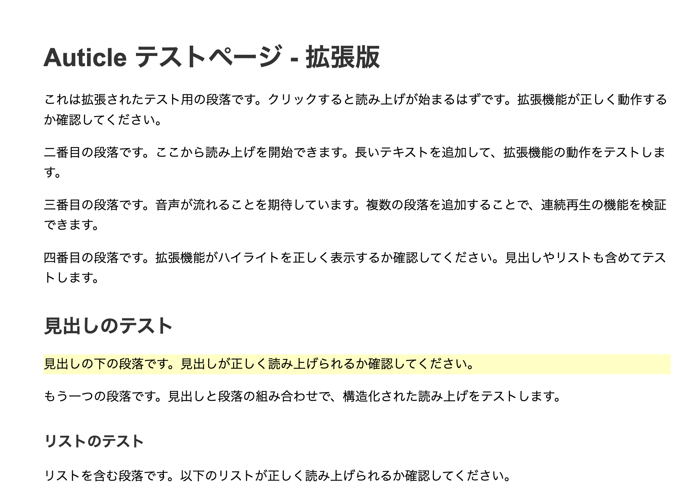

# Audicle

Audicle (Article + Audio) is a Chrome extension that reads web page article content aloud.

It provides a comfortable "reading while doing something else" experience by intelligently reading from the clicked paragraph to the end of the article and highlighting the playback position.

## ✨ Main Features



- **One-Click Playback**: Start reading just by clicking the paragraph you want to hear.
- **Intelligent Content Extraction**: Utilizes [Mozilla Readability.js](https://github.com/mozilla/readability) to remove ads and sidebars, extracting only the main text.
- **Structure-Aware Reading**: Recognizes headings and lists, adding prefaces like "Heading." or "This is a list." to make the structure easier to understand through audio alone.
- **Site-Specific Optimization**: Applies optimized extraction rules for specific domains (e.g., qiita.com) to achieve more natural reading.
- **Continuous Playback & Prefetching**: Automatically plays audio continuously to the end of the article. It minimizes gaps between chunks by prefetching the next audio data.
- **Synchronized Highlighting**: The paragraph currently being played is highlighted in real-time, allowing you to see at a glance where it is being read.
- **Playback Controls**: Toggle reading mode ON/OFF and pause/resume playback from the popup.

## 📖 How to Use

1. **Installation**: Go to `chrome://extensions`, select "Load unpacked", and load the **`packages/chrome-extension` directory**.
2. **Activation**: Open the article page you want to read, click the Audicle icon in the browser toolbar, and toggle the "Reading Mode" switch to ON in the popup.
3. **Playback**: Click on a highlightable paragraph on the page to start playback from that position.
4. **Controls**:
   - **Change Playback Position**: Click another paragraph to immediately move playback to that position.
   - **Pause/Resume**: Stop playback with the "Pause" button in the popup and continue with the "Resume" button.
   - **Stop Completely**: Turn the "Reading Mode" toggle switch OFF to completely stop playback and remove highlights.

## 🛠️ Architecture Overview

This extension consists of components with clearly separated responsibilities.

- **`popup.html` / `popup.js` / `popup.css`**: Provides the UI for user operation. It conveys the user's **intent** (ON/OFF, Pause/Resume) to `content.js` via `chrome.storage` or messages.
- **`content.js`**: The main script running on the page.
  - Extracts structured text using `Readability.js`.
  - Handles playback queue management, continuous playback logic, and synchronized highlighting.
  - Passes text to `background.js` and requests audio data retrieval.
- **`background.js`**: Service worker running in the background.
  - **Loosely Coupled Audio Synthesis Modules**: Adopts a loosely coupled design with `AudioSynthesizer` base class, `GoogleTTSSynthesizer` implementation, and `SynthesizerFactory`.
  - Generates audio data URLs from text based on the synthesis method specified in `config.json`.
  - Enables easy addition/modification of future TTS engines.
- **`config.json`**: Configuration file specifying the audio synthesis method to use.
- **`lib/Readability.js`**: Mozilla's content extraction library. Removes noise and provides high-quality text content.

### Audio Synthesis Module Design

The audio synthesis logic is separated as loosely coupled modules:

```javascript
// Unified Interface
class AudioSynthesizer {
  async synthesize(text) // Text -> Audio Data URL
}

// Google TTS Implementation
class GoogleTTSSynthesizer extends AudioSynthesizer {
  // Uses Google Translate TTS endpoint
}

// Selection by Factory
SynthesizerFactory.create(config.synthesizerType)
```

## 📂 Project Structure

This project is part of a monorepo configuration.

```bash
/ (Repo Root)
└── packages/
    ├── chrome-extension/   # Chrome Extension Source Code
    └── api-server/         # TTS API Server (Google Cloud TTS)
```

## ⚙️ Configuration

- **Reading Mode**: Toggle ON/OFF with the switch in the popup.
- **Pause/Resume**: Operate with buttons in the popup.
- **Audio Synthesis Method**: You can specify the TTS engine in `config.json` under `synthesizerType`. Reload the extension after changing settings.
  - **Available Engines**:
    - `google_tts`: Default. Uses Google Translate's unofficial API (Japanese/English).
    - `api_server`: Uses `packages/api-server` (Google Cloud TTS, High Quality).
    - `test`: For development. Plays a fixed sample audio.

> **📋 Detailed Guide**: See [AUDIO_SYNTHESIS_MODULES.md](AUDIO_SYNTHESIS_MODULES.md) for details on available audio synthesis modules.

## 🧪 Testing

### Basic Operation Test

1. **Update Chrome Extension**: Click the "Update" button for the Audicle extension at `chrome://extensions/`.
2. **Check on Test Page**:
   - Open `packages/chrome-extension/test/test.html` in the browser to test basic functions.
   - Click paragraphs to verify audio playback and highlighting.

### API Server Test

Steps when using the new API server (`packages/api-server`):

1. **Start API Server**:
   ```bash
   cd packages/api-server
   docker-compose up -d
   ```
2. **Change Configuration**:
   Edit `config.json` manually:
   ```json
   {
     "synthesizerType": "api_server"
   }
   ```
3. **Update Extension**: Click the update button at `chrome://extensions/`.
4. **Verify Operation**: Check playback on the test page or any web article.

## 🔧 For Developers - Adding New Site Rules

Steps to add extraction rules optimized for specific sites:

> **📋 Detailed Guide**: See `content-extract/RULE_ADDITION_GUIDE.md` for more information.

1. **Define Rule**: Add a new rule to `SITE_SPECIFIC_RULES` in `content-extract/rules.js`.
2. **Identify Selector**: Identify the CSS selector for the body text using Developer Tools on the target site.
3. **Set Priority**: `priority: 1000` is recommended for site-specific rules.
4. **Verify**: Reload the extension and check the Console logs on the target site.

## 📝 Notes

- **Supported Languages**: Google Translate TTS (`google_tts`) is optimized for Japanese and English.
- **Usage Limits**: Google Translate TTS is unofficial and may become unavailable in the future. Using `api_server` is recommended for stable operation.
- **Privacy**: The text to be read is sent to the selected audio synthesis server.
- **Browser Compatibility**: Developed for Google Chrome.
